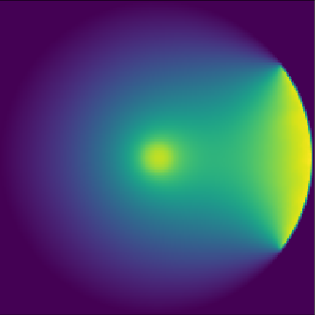

# WalkOnSpheres.jl
This package provides tools to solve PDE (currenty Laplace and Poisson) with the Monte Carlo Walk On Spheres algorithm. It uses NVIDIA's CUDA library, so if you don't have a NVIDIA GPU, some functions won't work.

# Example
## General linear elliptic PDE


# Introduction
There is two versions of the Walk On Spheres Algorithm implemented in this package : the said forward and reverse (Sawhney et al) (Qi et al).

The algorithm can solve some linear elliptic PDE : Poisson and Laplace problem with Dirichlet conditions (the reverse version can take into account Neumann types of boundary conditions) :

$$\Delta u(x) = f(x) \quad \forall x\in \Omega$$

$$u(x) = g(x) \quad \forall x \in \partial \Omega _D$$

$$\frac{\partial u(x)}{\partial n}  = h(x) \quad \forall x\in \partial \Omega _N$$

The Walk On Spheres algorithm offer the possibility to simulate PDEs without any meshing, and is fully, at least the forward version, suited to be ran on GPUs.

The first 9 minutes of the this video gives a nice introduction to the possibilities that the Walk On Spheres offers (https://www.youtube.com/watch?v=InWVU68KhMs&t=614s&ab_channel=RohanSawhney).

# Usage
The general usage is as bellow.

```julia
using WalkOnSpheres

# PDE definition
g(x,y) = 1. + 2*sin(atan(y,x))
∂Ω(x,y) = 1.0 - sqrt(x*x + y*y)
Ω = ((-1,1),(-1,1))
p = WalkOnSpheres.PDE(g,Ω,∂Ω)

# Solving
axs,u = WalkOnSpheres.ForwardSolveGPU(p,ngrid=20,nwalks=200)

# Display
WalkOnSpheres.plot2D(axs,u)
```
The ReverseSolve is called a bit differently, but some examples can be seen in the examples folder of this package.

Note that the majority of the functions can be called no matter what the dimension is. If you define for example $g$ as taking $3$ arguments, than the solver will be 3D. Some examples below.


# Bibliography

Rohan Sawhney and Keenan Crane. 2020. Monte Carlo Geometry Processing:
A Grid-Free Approach to PDE-Based Methods on Volumetric Domains. ACM
Trans. Graph. 38, 4, Article 1 (July 2020), 18 pages

Qi, Yang, Dario Seyb, Benedikt Bitterli, et Wojciech Jarosz. « A Bidirectional Formulation for Walk on Spheres ». Computer Graphics Forum 41, nᵒ 4 (juillet 2022): 51‑62. https://doi.org/10.1111/cgf.14586.